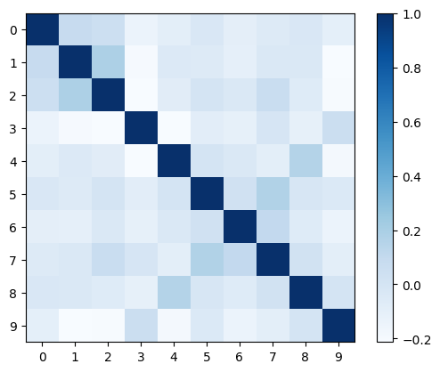

# NLP_MultiLableClassification

This work is assignment submission to Augnito.ai as part of their recruitment process.

## Dataset (ecthr_b)
1. We are working on a multi-label classification problem based on data from European Court of Human Rights. The dataset consists of factual paragraphs(facts) from the case description.
2. Each case is mapped to articles(1-10) of ECHR that were allegedly violated(considered by the court).

If we analyze the train dataset provided here : https://huggingface.co/datasets/lex_glue, we can get the following inferences regarding the dataset.


1. Here we have articles 1-10 and their respective frequencies standing for how many times they were violated in the train dataset.


1. Here we can see the correlations between article violations, we can see that articles 1-3 are compartively highly correlated as compared to other article.


## Data Preprocessing
1. The function ```preprocess_text()```, takes the joined paragraphs and remove all the special characters, remove all the double spaces and all the single letter words.
2. We then tokenize the string returned using TensorFlow standard Tokenizer, with num_words = 5000 in the case of the base_case LSTM model
3. For the BERT based model we tokenize it using the pre_processed BERT tokenizer (from `bert-base-uncased` model).
4. Since the data is already splitted in Train, Validation and Test datasets on the source repository, we don't split them further.

## Documentation
1. At start I tried to use standard LSTM for multilabel classification, which is an end-to-end trained model on the dataset provided without using any NLP based information.
2. Since its results`(50% Accuracy)` were not exceptional, I decided to encorporate existing pre-trained NLP models internally.
3. I used pre-trained `bert-based-uncased` NLP model to tokenize the inputs and then further train the model for 3 epochs to get scores               
            
                        precision    recall  f1-score   support

                1       0.86      0.57      0.68        76
                2       0.64      0.70      0.67       234
                3       0.74      0.44      0.55       196
                4       0.65      0.63      0.64       394
                5       0.78      0.34      0.47       188
                6       1.00      0.18      0.31        11
                7       0.74      0.76      0.75       106
                8       0.57      0.53      0.55        43
                9       0.57      0.12      0.21        32
               10       0.75      0.75      0.75       155

        micro avg       0.69      0.58      0.63      1435
        macro avg       0.73      0.50      0.56      1435
        weighted avg    0.70      0.58      0.62      1435
        samples avg     0.68      0.62      0.62      1435

4. Here we can see, we have a significant improvement over the LSTM based model.

## Further Developments
1. Since we have really long text to put lables to, as compare to something like tweets or reviews. Since BERT can typically process small texts only, our model is not performing well enough. 
2. To resolve this, we can use hierarchical BERT models, which decompose the large texts into subunits to capture meaning at lower level and then combine these sub-sentences. 
3. Reference for Hierarchical BERT models can be found here : https://arxiv.org/pdf/1910.10781.pdf.

4. The primary idea is to encode a document at both the token level and the segment level, token level encoding is done by pre-trained NLP models and then both are combined and fed into a shallow transformer layer to make the paragraph representations context aware.

5. Then the output of the transformer layer can be fed to a classification layer.
